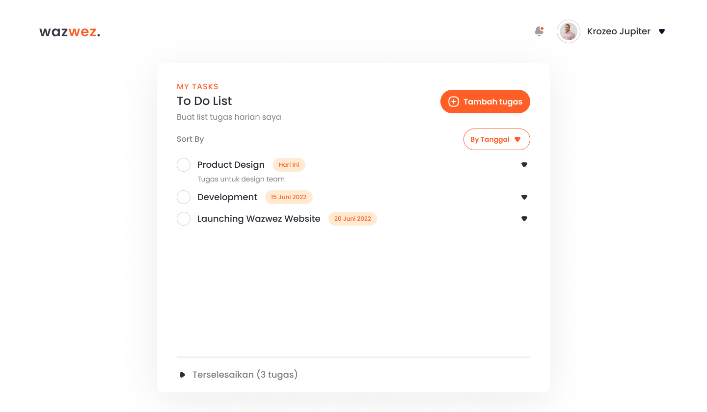

# Wazwez - Aplikasi Web Manajemen Tugas

 adalah aplikasi web manajemen tugas yang dirancang untuk membantu Anda mengatur dan melacak proyek pribadi dan tim dengan lebih efektif. Dengan antarmuka yang bersih dan fitur yang fokus pada fungsionalitas inti, Wazwez membuat pengelolaan proyek menjadi sederhana dan efisien.

---

## Fitur Utama

- **Manajemen Proyek:** Buat dan kelola berbagai proyek dengan nama dan deskripsi yang jelas.
- **Sub-Tugas Terperinci:** Pecah proyek besar menjadi sub-tugas yang lebih kecil dan mudah dikelola.
- **Pelacakan Progres:** Lacak kemajuan setiap sub-tugas dan lihat status proyek Anda secara keseluruhan.
- **Tampilan Sederhana:** Antarmuka pengguna yang minimalis dan intuitif, sehingga Anda bisa fokus pada pekerjaan.

## Preview

### Dashboard

### Create Task

### Sorting Task

### Completed Task

### Subtask

### Edit Task

